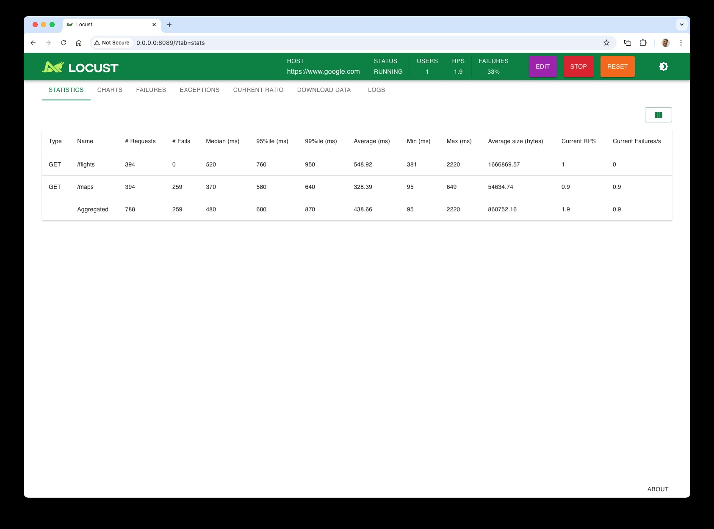

# Quick, learn Locust

## Getting Started

### Using virtual environment venv

Python virtual environments enable you to set up a Python sandbox with its
own set of packages separate from the system site-packages in which to work.

#### Create

```bash
$ python -m venv .venv
```

#### Activate

To activate on macOS and Linux.
```bash
$ source .venv/bin/activate
```

To activate on Windows.
```bash
$ .venv\Scripts\activate.bat
```

To activate on Windows with PowerShell.
```bash
$ .venv\Scripts\Activate.ps
```

#### Deactivate

When done,run:
```bash
$ deactivate
```

### Using pip to install pytest

pip is the tool used to install Python packages, and it is installed as part of
your Python installation.

Confirm pip version by running:
```bash
$ pip --version
```

You should see:
```bash
pip 24.0 from /Users/ ... /.venv/lib/python3.11/site-packages/pip (python 3.11)
```

Install locust by running:
```bash
$ pip install locust
```

Confirm the locust version by running:
```bash
$ locust --version
```

You should see:
```bash
locust 2.32.4 from /Users/ ... /.venv/lib/python3.11/site-packages/locust (python 3.11)
```

## Running the locust testing framework

Run locust with the following command:
```bash
$ locust -f <filename>
```

Show help message and configuration info:
```bash
$ locust --help
```

Learn more from the Locust documentation:
```bash
https://docs.locust.io
```

## Hello World

1. Open the file `locustfile.py`, which is described on this _Your first test_ page: https://docs.locust.io/en/stable/quickstart.html

2. This "HttpUser" will make an HTTP request to the Wikipedia page `/wiki/Locust`, then to `/wiki/Python`, and then repeat.

3. In you current directory, you will run the `locust` command.

Run this:
```bash
$ locust -f locustfile.py
```

And you should see the following output:
```bash
[2024-12-17 08:00:13,012] Your-Machine-Name/INFO/locust.main: Starting Locust 2.32.4
[2024-12-17 08:00:13,030] Your-Machine-Name/INFO/locust.main: Starting web interface at http://0.0.0.0:8089
```

NOTE: Your web interface might be reached as `localhost` instead of `0.0.0.0`.

4. Open http://0.0.0.0:8089

5. Enter the Host as `https://en.wikipedia.org` to provide a host name and fill in the rest as shown here:


6. Click the Start button.

7. Assuming everything is working properly, you should see the Statistics tab populate with data related to the test run, such as:



8. On the Charts tab, you should see charts like these:


NOTE: The site may detect the automated GET requests from Locust and start to return errors.

9. To stop the Locust testing, click the Stop button.

10. You are all set to start your Locust learning journey.

11. To exit the Locust web UI, press `ctrl + C` as the keyboard interrupt.

## Other Locust Tutorials

1. Check out the [Locust](https://locust.io/) project page

2. _Quick Tutorial on Locust_ provides information on testing a simple server http://oak.cs.ucla.edu/refs/locust/index.html

3. [Quickstart: Create and run a load test by using a Locust script and Azure Load Testing](https://learn.microsoft.com/en-us/azure/load-testing/quickstart-create-run-load-test-with-locust)

4. [Learning Locust: Documentation, Tutorials, Videos](https://www.softwaretestingmagazine.com/tools/learning-locust-documentation-tutorials-videos/)

5. [Performance Testing with Locust](https://dogangunemre.medium.com/performance-testing-of-the-swagger-petstore-api-with-locust-c9a20e7750b1)

# Browse Documentation Test

To continue with the tutorial, open the [Browse Documentation Test](tests/Browse%20Documentation%20Test.md) page.
